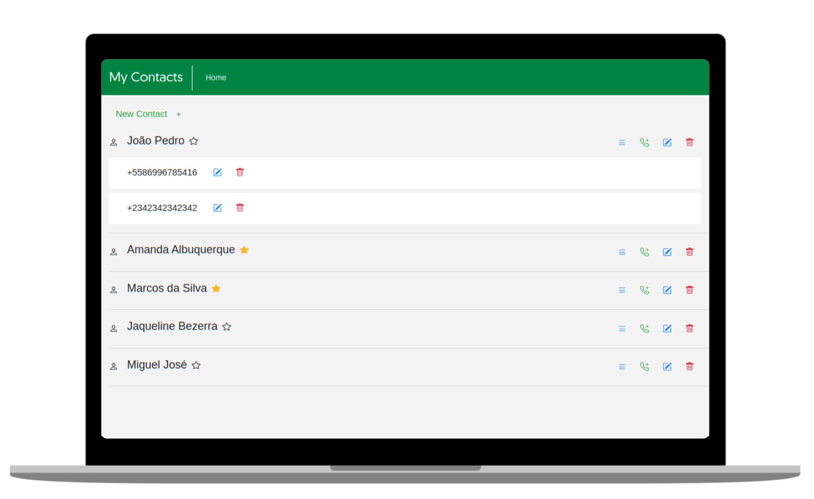

# My Contacts

#### Api server: [My Contacts API](https://github.com/cardosorrenan/my_contacts_api)

<p align="center">
  
</p>

## Setup
 
 ##### 1. Get repo
 ``` 
  git clone https://github.com/cardosorrenan/my_contacts
 ```
 
 ##### 2. Go to folder project
 ``` 
  cd ./my_contacts
 ```
 
 ##### 3. Install dependencies
 
 - npm
 ``` 
  npm i
 ```
 
 - yarn
 ``` 
  yarn
 ```
 
 ##### 4. Serve project
 ``` 
  ng serve --open
 ```
 
 ##### 5. [localhost:4200](http://localhost:4200)
